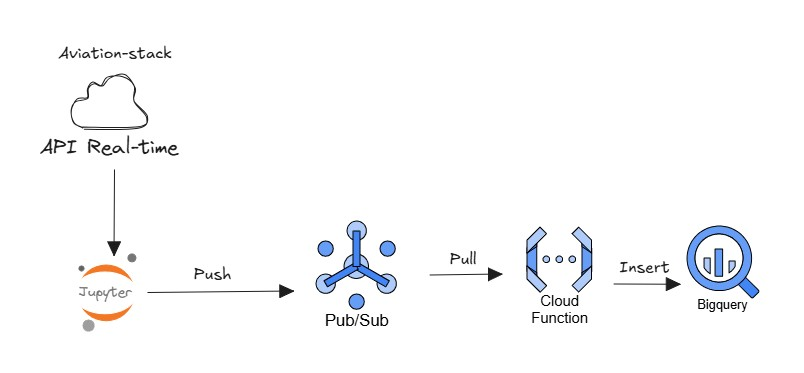

# Arquitectura de Ingesta en Tiempo Real con GCP

Este proyecto implementa un flujo end-to-end en tiempo real que consume datos de una API externa, los publica en Pub/Sub y los almacena en BigQuery mediante Cloud Functions.
El objetivo es construir un pipeline ligero, escalable y serverless para procesar eventos en vivo.

## Arquitectura General

La arquitectura consta de cuatro componentes principales:

### Fuente de Datos – API en Tiempo Real
Se utiliza la API de AviationStack (o similar) para obtener datos de vuelos en vivo.
Esta API entrega información actualizada cada pocos segundos.

### Publisher – Jupyter Notebook (Python)
Un script en Python ejecutado desde Jupyter Notebook realiza:
- Llamados periódicos a la API.
- Limpieza y estructuración del JSON.
- Publicación de cada evento hacia Pub/Sub (modo push).

El notebook actúa como productor de mensajes.

### Mensajería – Pub/Sub

Pub/Sub funciona como un buffer distribuido que desacopla la ingesta del procesamiento.
Características:
- Alta escalabilidad.
- Baja latencia.
- Entrega garantizada (at-least-once).

### Procesamiento – Cloud Function

Una Cloud Function con trigger Pub/Sub (pull):

- Se ejecuta automáticamente por cada mensaje recibido.
- Procesa y valida la data.
- Realiza inserts en BigQuery.

### Almacenamiento – BigQuery

Destino final de los datos.
Se usa una tabla particionada para:

- Consultas rápidas.
- Costos optimizados.
- Facilidad para construir dashboards sobre datos en tiempo real.

##  Tecnologías Utilizadas

| Componente     | Servicio                  | Uso                      |
| -------------- | ------------------------- | ------------------------ |
| Ingesta        | API Rest externa          | Datos en tiempo real     |
| Productor      | Jupyter Notebook + Python | Push hacia Pub/Sub       |
| Mensajería     | Pub/Sub                   | Transporte y colas       |
| Procesamiento  | Cloud Functions           | ETL ligero y serverless  |
| Almacenamiento | BigQuery                  | Analítica y persistencia |
